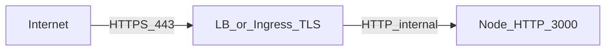

# Transport / TLS posture (intended design)

## Where TLS terminates

- **Public clients** → **TLS terminates at the edge**: reverse proxy (nginx, Caddy), cloud load balancer (ALB/NLB), or Kubernetes Ingress with TLS certificate (Let’s Encrypt or managed cert).
- **Behind the edge**, traffic to application pods is often **HTTP on a private network** (cluster service network). This is acceptable when the network is not exposed to the internet.

## HTTP → HTTPS redirect

- Enforced at the **edge** (301/308 redirect from port 80 to 443), not inside the NestJS process.
- The Node app listens on HTTP; it does not terminate TLS in the default deployment model.

## Traffic classification

| Class | Examples | Trust |
|-------|----------|--------|
| **Public** | `GET /products`, `POST /auth/login`, Swagger `/api` | Authenticated or anonymous over internet-facing HTTPS |
| **Internal** | Health checks from orchestrator, metrics scraper | Same cluster/VPC; may use HTTP |
| **Trusted by placement only** | Admin-only routes (`DELETE /orders/:id` with `admin` role) | Still require **application-level** JWT + roles; network placement is **not** sufficient alone |

## Reverse proxy and rate limiting

- With `TRUST_PROXY=1` (or `NODE_ENV=prod` with trust proxy enabled), the app trusts `X-Forwarded-For` / `X-Real-IP` so `@nestjs/throttler` sees the **client** IP, not the proxy’s.

## Local development

- Developers run plain HTTP on `localhost:3000`. Production posture above is **documented intent**; TLS is not terminated in-process for this API.
